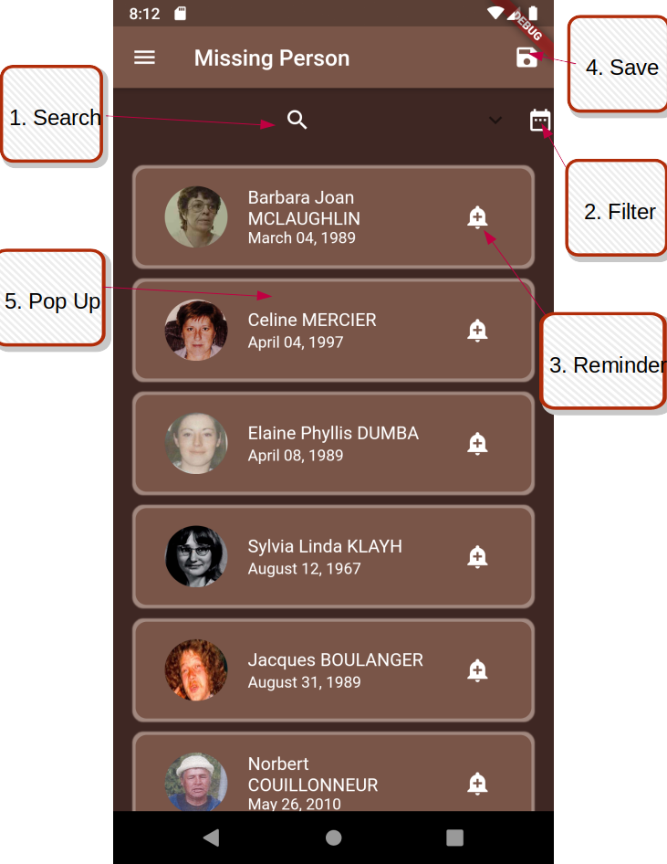

# Major Group Project
The starter code for the major group project.

Group members (3-5) (no Student IDs, only names):
1. Joseph Fanous (JosephFanous)
2. Tran Tien Anh Ta (trantienanhta)
3. Jessica Querido (jessquerido)

## Instructions
--------------------------
### Drawer

From top to bottom,
1. Main, missing person page
2. Saved Page, saved person from the missing person list
3. Map Page, showcase misisng people in your city
4. Breakdown page, a breakdown table and charts of missing people in Canada
5. Sync page, download the cloud storage to local database
6. License page

--------------------------
### Exit

"Are you sure you want to exit?"
To stop annoying accidental back button

--------------------------
### Main Page
- Search Bar

- Calendar

- Long Press

- Notification

- Dialog Map

This showcase the distance between you and person. The red line signify the direct line between.

- Save

1. Expandable search field
2. Filter people missing by the day they went missing, to reset the list tap the icon again and tap outside of the dialog to dismiss it. This will reset the filter.
3. Remind "Did you find me?" on the day you set
4. Tap one to multiple people and hit save, this will save this specific profile to your Saved Screen
5. Long Press each tile for more information about that person

8. Search people by their name

--------------------------

### Saved Page

9. Delete the save profile from your list

--------------------------

### Breakdown Page
- Data Table

- Charts

The Data Table and Charts have 2 categories and each has 2 sub-categories. 

+ Location
  + Province 
  + City
+ Date
  + Year
  + Month

--------------------------

### Map Page

When you tap the "+" button, the map showcase the people that went missing in your city. To showcase other cities, please change your location to another city and repeat the process.

--------------------------

### Sync Page

From top to bottom,
- Refresh: delete the local db then download the firebase to the local db again
- Download: download the firebase to local db 
- Delete: clear the local db

--------------------------

### About Page

--------------------------

### Featured Person Notifications

When viewing the missing persons list, a featured person will appear as a notification. Tapping the notification will bring the user to a page with more details about the person.

 

--------------------------

### Settings Page

The settings page contains 3 types of settings:

Language Settings: Allows the user to switch between english and french versions of the app.

Notification Settings: Allows the user to enable and disable two types of notifications:

1) Scheduled Notifications: These are the notifications that the user schedules in the future by clicking the alert icon next to a person in the list.
2) Featured Person Notifications: These are the notifications that display a random featured person when viewing the persons screen.
  
Tutorial Settings: Allows the user to enable or disable the in-app tutorials.

--------------------------

### References

Missing persons information was retrieved from https://www.canadasmissing.ca/index-eng.htm using a python script, found in the python folder of the project.

--------------------------

### Note

On the use of certain notifications, the following exception is thrown:

This is a known issue with Firebase, and does not affect the functioning of the app: https://github.com/firebase/firebase-android-sdk/issues/1662
